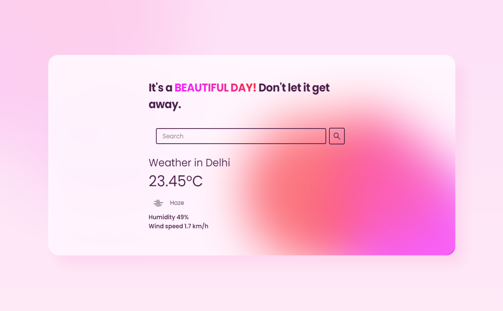
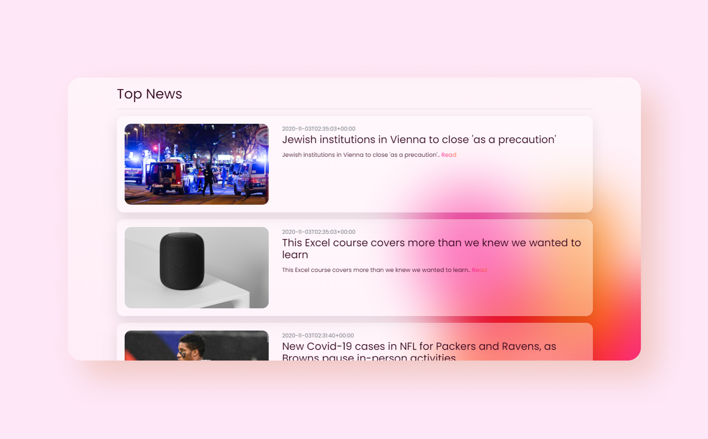

## Weather News App - Glassmorphism ❄️ + Orb Animation

> This JS ES6 application will show the 
> - weather data that you query for: using the openweathermap.org API 
> - today's top news around the world: using the mediastack.com API 




```
An Icon that shows the weather status, the temperature value in Celsius/Fahrenheit unit,
the weather information (clear sky), and afterward the users's city
and country (New Delhi, India), use mediastackAPI to fetch top news headlines.
```
