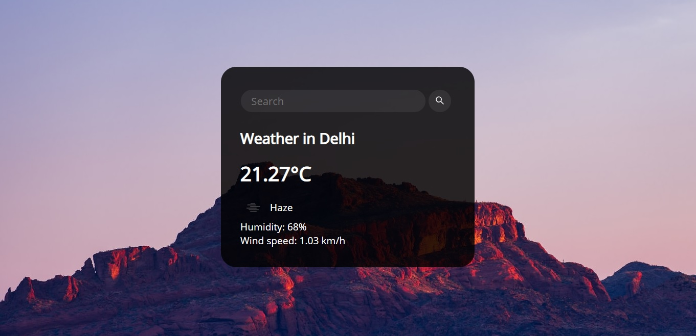

## Weather App

> This JS ES6 application will show the weather data that you query for: using the openweathermap.org API 



```
An Icon that shows the weather status, the temperature value in Celsius/Fahrenheit unit,
the weather information (clear sky), and afterward the users's city
and country (New Delhi, India).
```

```
When the user clicks on the temperature value, that will convert it from Celsius to Fahrenheit.
```

#### The API provider is http://www.OpenWeatherMap.org
